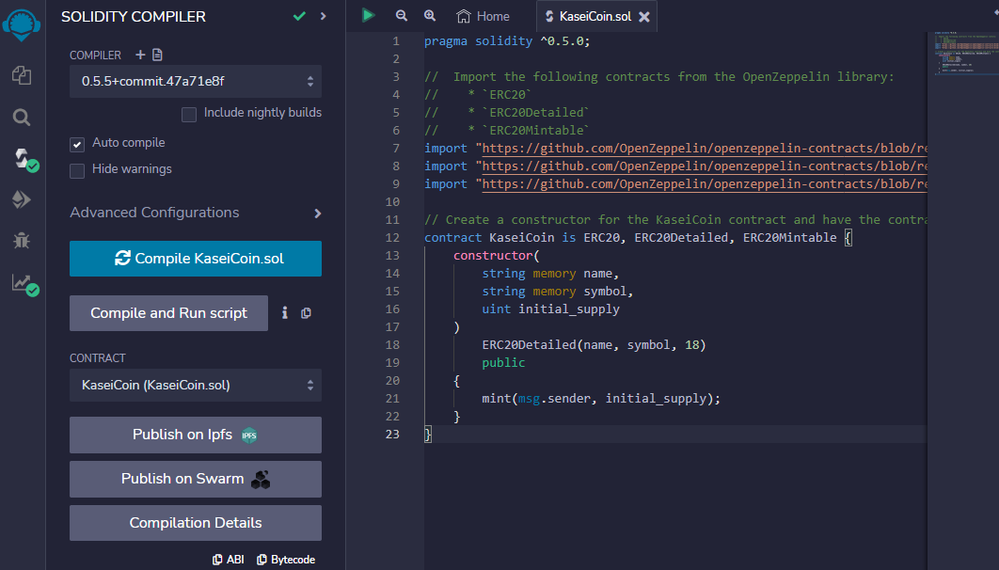
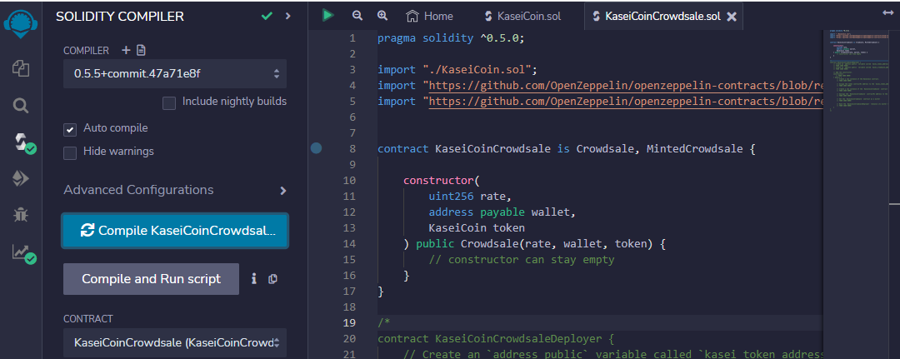
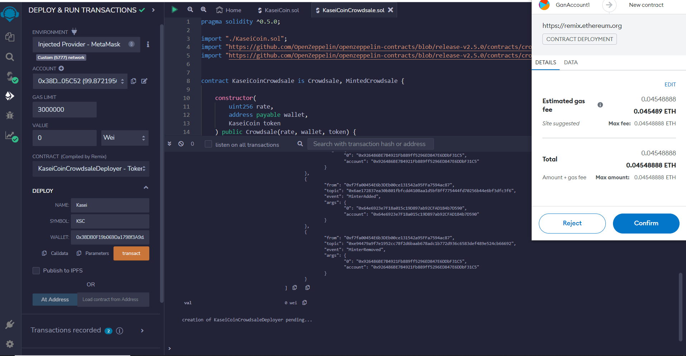
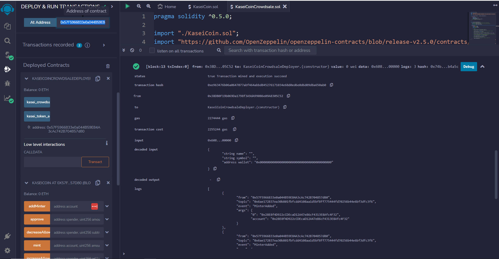
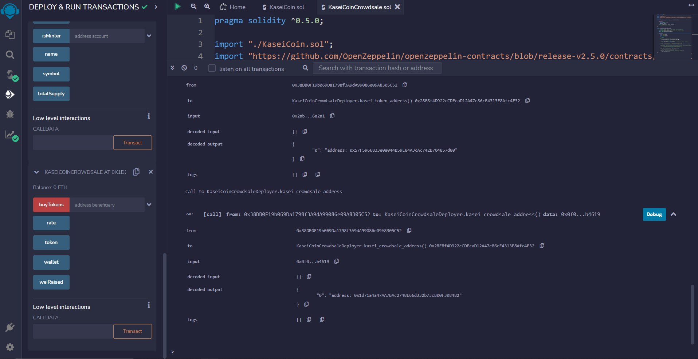
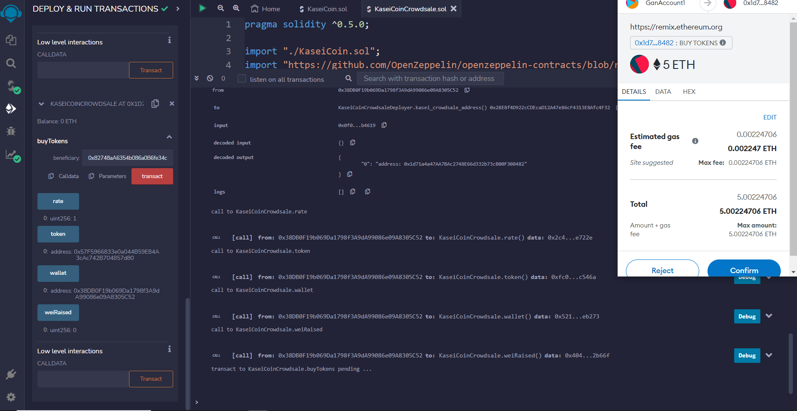
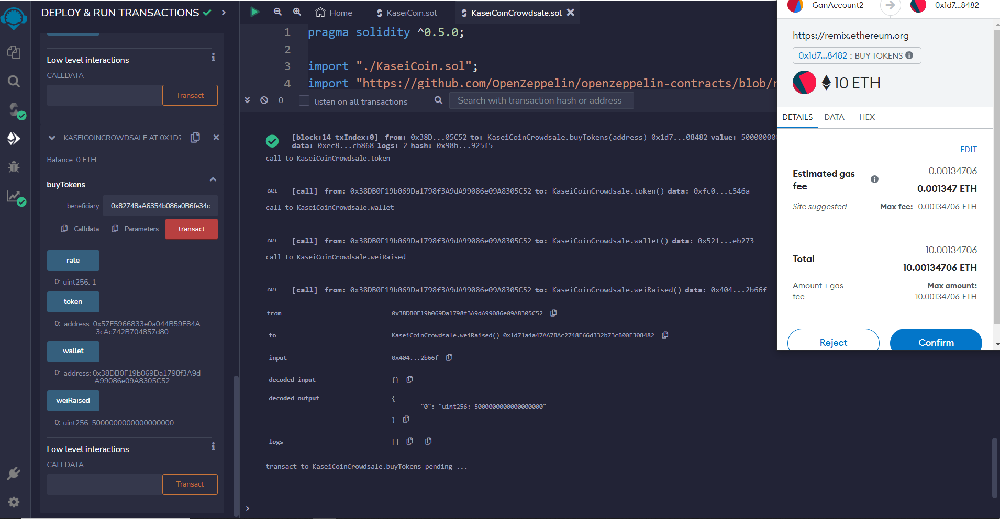
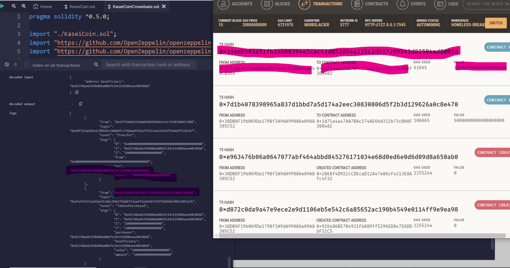
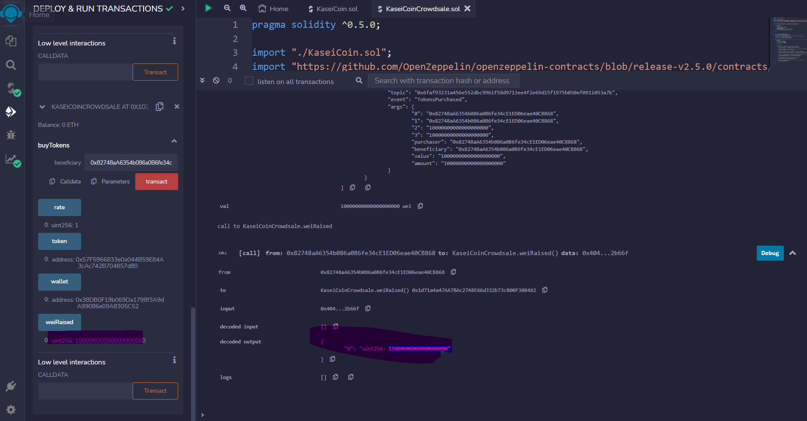

# Tokenomics-Challenge

### Organization
The central solidity file is 
1. 

### Code and Dependencies
Requires the download and install of Ganache and MetaMask

## Objectives
- 

## Results and Data Story
The result was a successfully deployed contract and token minting. Here is a series of screenshot that shows the progression of the token contract deployment.

[Repo Link](https://github.com/bweilers/Tokenomics-Challenge/)  

 
[Repo Link](https://github.com/bweilers/Tokenomics-Challenge/)  

[Repo Link](https://github.com/bweilers/Tokenomics-Challenge/)  

 
[Repo Link](https://github.com/bweilers/Tokenomics-Challenge/)  

[Repo Link](https://github.com/bweilers/Tokenomics-Challenge/)  

[Repo Link](https://github.com/bweilers/Tokenomics-Challenge/)  

[Repo Link](https://github.com/bweilers/Tokenomics-Challenge/)  

[Repo Link](https://github.com/bweilers/Tokenomics-Challenge/)  

[Repo Link](https://github.com/bweilers/Tokenomics-Challenge/)  

[Repo Link](https://github.com/bweilers/Tokenomics-Challenge/)  

